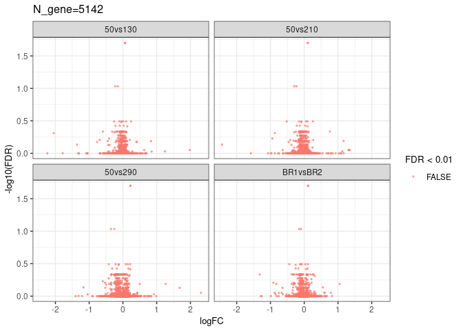

## 使用するパッケージ

    library(tidyverse)
    library(svglite)
    library(ggrepel)
    library(ComplexHeatmap)
    library(edgeR)
    library(circlize)
    library(tidyplots)

## データ読込

    count_data <- read_csv("../count_numreads_RSEM_GeneName.csv")
    # 列名が「S01.genes.results」とかなので、サンプル名（S01など）だけにする
    colnames(count_data)[-1] <- str_split_i(colnames(count_data[-1]), pattern = "\\.", i = 1)
    meta_data <- read_tsv("../metadata.tsv") %>%
      rename(Sample = Sample_ID) %>%
      mutate(Pipetting_Speed = as.factor(Pipetting_Speed)) %>%
      mutate(Biological_Replicates = as.factor(Biological_Replicates))

中身はこんな感じ

    head(count_data)

    ## # A tibble: 6 × 25
    ##   Name     S01    S02   S03    S04    S05    S06    S07   S08   S09    S10
    ##   <chr>  <dbl>  <dbl> <dbl>  <dbl>  <dbl>  <dbl>  <dbl> <dbl> <dbl>  <dbl>
    ## 1 VPS8   1652   1564   1539  1419   1458   1292   1350   1423  1428  1473 
    ## 2 EFB1  16532. 17502. 15523 14599. 14400. 15938. 15354  17266 16413 18306.
    ## 3 ERP2   1773   1796   1784  1496   1709   1698   1624.  1818  1783  1690 
    ## 4 FUN14  1078.   961    994   785    989    958    859    952   912   900 
    ## 5 SPO7    521    452    478   396    468    442    423    530   499   451 
    ## 6 MDM10   774.   779    777   679    721    720    656    755   735   726 
    ## # ℹ 14 more variables: S11 <dbl>, S12 <dbl>, S13 <dbl>, S14 <dbl>, S15 <dbl>,
    ## #   S16 <dbl>, S17 <dbl>, S18 <dbl>, S19 <dbl>, S20 <dbl>, S21 <dbl>,
    ## #   S22 <dbl>, S23 <dbl>, S24 <dbl>

    head(meta_data)

    ## # A tibble: 6 × 5
    ##   Fastq_prefix Sample Pipetting_Speed Biological_Replicates Technical_Replicates
    ##   <chr>        <chr>  <fct>           <fct>                                <dbl>
    ## 1 LAB_465_01_… S01    290             1                                        1
    ## 2 LAB_465_02_… S02    210             1                                        1
    ## 3 LAB_465_03_… S03    130             1                                        1
    ## 4 LAB_465_04_… S04    50              1                                        1
    ## 5 LAB_465_05_… S05    290             2                                        1
    ## 6 LAB_465_06_… S06    210             2                                        1

## カウントの分布を見る（サンプル01）

    count_data %>% ggplot(aes(x=S01)) + geom_histogram() + scale_x_log10()

    ## Warning in scale_x_log10(): log-10 transformation introduced infinite values.

    ## `stat_bin()` using `bins = 30`. Pick better value with `binwidth`.

    ## Warning: Removed 37 rows containing non-finite outside the scale range
    ## (`stat_bin()`).

## 低発現遺伝子を取り除く

サンプル間の平均カウントが1以下の遺伝子を取り除く

    is_low_count <- apply(count_data[, -1], 1, mean) <= 1
    count_data_filterd <- count_data[!is_low_count,]
    print(str_c("Before filtering: ", nrow(count_data), " genes"))

    ## [1] "Before filtering: 5193 genes"

    print(str_c("After filtering: ", nrow(count_data_filterd), " genes"))

    ## [1] "After filtering: 5142 genes"

もう一度カウントの分布を見てみる（サンプル01）

    count_data_filterd %>% ggplot(aes(x=S01)) + geom_histogram() + scale_x_log10()

    ## Warning in scale_x_log10(): log-10 transformation introduced infinite values.

    ## `stat_bin()` using `bins = 30`. Pick better value with `binwidth`.

    ## Warning: Removed 8 rows containing non-finite outside the scale range
    ## (`stat_bin()`).

## [MDS](https://www.nttcoms.com/service/research/dataanalysis/multi-dimensional-scaling/)

### サンプル間の相関係数

    inter_sample_correlation <- cor(count_data_filterd[, -1])
    inter_sample_correlation %>% as.vector() %>% summary()

    ##    Min. 1st Qu.  Median    Mean 3rd Qu.    Max. 
    ##  0.9528  0.9891  0.9958  0.9926  0.9986  1.0000

    as.data.frame(inter_sample_correlation) %>%
      rownames_to_column(var = "RowName") %>%
      pivot_longer(cols = -RowName, names_to = "ColumnName", values_to = "Value") %>%
      write_csv(file = "inter_sample_correlation.csv")

### 相関係数をもとに各サンプルのポジションを計算

    result_cmdscale <- cmdscale(1 - inter_sample_correlation, eig = TRUE, k = 2)
    mds_pos <- tibble(
        Sample = rownames(result_cmdscale$points),
        xPos = result_cmdscale$points[, 1],
        yPos = result_cmdscale$points[, 2]
    )
    head(mds_pos)

    ## # A tibble: 6 × 3
    ##   Sample     xPos      yPos
    ##   <chr>     <dbl>     <dbl>
    ## 1 S01    -0.00623 -0.00235 
    ## 2 S02    -0.00410 -0.000795
    ## 3 S03    -0.00850  0.000273
    ## 4 S04    -0.0101   0.00140 
    ## 5 S05    -0.0165  -0.00197 
    ## 6 S06    -0.00846 -0.00129

    write_csv(mds_pos, file = "mds_positions.csv")

### メタデータと合わせて、プロット

    mds_plot <- mds_pos %>% 
      full_join(meta_data, by=join_by("Sample")) %>%
      ggplot(aes(x=xPos, y=yPos, color=Pipetting_Speed, shape = Biological_Replicates)) +
      geom_point() +
      geom_point(size=3) +
        geom_text_repel(aes(label = Sample), show.legend = FALSE) +
        scale_color_manual(
          values = c(
            "#afeeee",
            "#00bfff",
            "#0000ff",
            "#191970"
          )
        ) +
        xlab("Coordinate 1") +
        ylab("Coordinate 2") +
        labs(color="Pipetting\n speed") +
        labs(shape="Biological\n replicate") +
        theme_bw() +
        theme(
          theme(plot.margin= unit(c(0, 0, 0, 0), "lines")),
          aspect.ratio = 1,
          legend.position="bottom",
          plot.background = element_rect(fill = "transparent", colour = NA),
          legend.background = element_rect(fill = "transparent", colour = NA),
          axis.title.y = element_text(size = 14),
          strip.background = element_blank(),
          text = element_text(family = "Arial", color = "black"),
          axis.title.x = element_text(size = 14),       # X軸タイトルのフォントサイズ
          axis.text.x = element_text(size = 12, color="black"),        # X軸ラベルのフォントサイズ
          axis.text.y = element_text(size = 12, color="black"),        # Y軸ラベルのフォントサイズ
          legend.title = element_text(size = 13),       # 凡例タイトルのフォントサイズ
          legend.text = element_text(size = 11),        # 凡例ラベルのフォントサイズ
          plot.title = element_text(size = 16, hjust = 0.5) # プロットタイトルのフォントサイズと中央寄せ
          ) +
      ggtitle("MDS Plot") +
      guides(color = guide_legend(order = 1, nrow = 2),
        shape = guide_legend(order = 2, nrow = 2))
    print(mds_plot)

    ggsave(filename = "mds_plot.svg", width = 470/72, height = 450/72, plot = mds_plot)

## ヒートマップ

    #col_fun <- colorRamp2(c(0, 1), c("blue", "red"))
    col_fun <- colorRamp2(c(0.9, 1), c("blue", "red"))
                          
    ha <- HeatmapAnnotation(
        Speed = meta_data$Pipetting_Speed,
        Biorep = meta_data$Biological_Replicates,
        annotation_legend_param = list(
        Speed = list(title = "Pipetting speed"),
        Biorep = list(title = "Biological replicate")
      ),
      annotation_label = list(
        Speed = list(title = "Pipetting speed"),
        Biorep = list(title = "Biological replicate")
      ),
        col = list(
            Speed = c(
            "50" = "#afeeee",
            "130" = "#00bfff",
            "210" = "#0000ff",
            "290" = "#191970"
            ),
            Biorep = c(
            "1" = "#ffd700",
            "2" = "#32cd32",
            "3" = "#ffb6c1"
            )
        )
    )
    ra <- rowAnnotation(
      Speed = meta_data$Pipetting_Speed,
      Biorep = meta_data$Biological_Replicates,
      annotation_label = list(
        Speed = list(title = "Pipetting speed"),
        Biorep = list(title = "Biological replicate")
      ),
      col = list(
        Speed = c(
          "50" = "#afeeee",
          "130" = "#00bfff",
          "210" = "#0000ff",
          "290" = "#191970"
        ),
        Biorep = c(
          "1" = "#ffd700",
          "2" = "#32cd32",
          "3" = "#ffb6c1"
        )
      ),
      show_legend = FALSE
    )
    heatmap <- Heatmap(
      inter_sample_correlation,
      name = "PCC",
      top_annotation = ha,
      left_annotation = ra,
      width = unit(9, "cm"),
      height = unit(9, "cm"),
      col = col_fun,
      column_title_gp = gpar(fontsize = 14, fontfamily = "Arial"),  # 列タイトルのフォント設定
      row_title_gp = gpar(fontsize = 14, fontfamily = "Arial"),     # 行タイトルのフォント設定
      column_names_gp = gpar(fontsize = 12, fontfamily = "Arial"),  # 列ラベルのフォント設定
      row_names_gp = gpar(fontsize = 12, fontfamily = "Arial"),     # 行ラベルのフォント設定
      heatmap_legend_param = list(
        title = "PCC",
        direction = "horizontal",
        title_gp = gpar(fontsize = 11, fontfamily = "Arial"),       # 凡例タイトルのフォント設定
        labels_gp = gpar(fontsize = 11, fontfamily = "Arial")       # 凡例ラベルのフォント設定
      )
    )

    ## Warning in grid.Call(C_textBounds, as.graphicsAnnot(x$label), x$x, x$y, :
    ## ポストスクリプトフォントのデータベースにフォントファミリ 'Arial'
    ## が見付かりません
    ## Warning in grid.Call(C_textBounds, as.graphicsAnnot(x$label), x$x, x$y, :
    ## ポストスクリプトフォントのデータベースにフォントファミリ 'Arial'
    ## が見付かりません
    ## Warning in grid.Call(C_textBounds, as.graphicsAnnot(x$label), x$x, x$y, :
    ## ポストスクリプトフォントのデータベースにフォントファミリ 'Arial'
    ## が見付かりません
    ## Warning in grid.Call(C_textBounds, as.graphicsAnnot(x$label), x$x, x$y, :
    ## ポストスクリプトフォントのデータベースにフォントファミリ 'Arial'
    ## が見付かりません
    ## Warning in grid.Call(C_textBounds, as.graphicsAnnot(x$label), x$x, x$y, :
    ## ポストスクリプトフォントのデータベースにフォントファミリ 'Arial'
    ## が見付かりません
    ## Warning in grid.Call(C_textBounds, as.graphicsAnnot(x$label), x$x, x$y, :
    ## ポストスクリプトフォントのデータベースにフォントファミリ 'Arial'
    ## が見付かりません
    ## Warning in grid.Call(C_textBounds, as.graphicsAnnot(x$label), x$x, x$y, :
    ## ポストスクリプトフォントのデータベースにフォントファミリ 'Arial'
    ## が見付かりません
    ## Warning in grid.Call(C_textBounds, as.graphicsAnnot(x$label), x$x, x$y, :
    ## ポストスクリプトフォントのデータベースにフォントファミリ 'Arial'
    ## が見付かりません
    ## Warning in grid.Call(C_textBounds, as.graphicsAnnot(x$label), x$x, x$y, :
    ## ポストスクリプトフォントのデータベースにフォントファミリ 'Arial'
    ## が見付かりません
    ## Warning in grid.Call(C_textBounds, as.graphicsAnnot(x$label), x$x, x$y, :
    ## ポストスクリプトフォントのデータベースにフォントファミリ 'Arial'
    ## が見付かりません
    ## Warning in grid.Call(C_textBounds, as.graphicsAnnot(x$label), x$x, x$y, :
    ## ポストスクリプトフォントのデータベースにフォントファミリ 'Arial'
    ## が見付かりません
    ## Warning in grid.Call(C_textBounds, as.graphicsAnnot(x$label), x$x, x$y, :
    ## ポストスクリプトフォントのデータベースにフォントファミリ 'Arial'
    ## が見付かりません
    ## Warning in grid.Call(C_textBounds, as.graphicsAnnot(x$label), x$x, x$y, :
    ## ポストスクリプトフォントのデータベースにフォントファミリ 'Arial'
    ## が見付かりません
    ## Warning in grid.Call(C_textBounds, as.graphicsAnnot(x$label), x$x, x$y, :
    ## ポストスクリプトフォントのデータベースにフォントファミリ 'Arial'
    ## が見付かりません
    ## Warning in grid.Call(C_textBounds, as.graphicsAnnot(x$label), x$x, x$y, :
    ## ポストスクリプトフォントのデータベースにフォントファミリ 'Arial'
    ## が見付かりません
    ## Warning in grid.Call(C_textBounds, as.graphicsAnnot(x$label), x$x, x$y, :
    ## ポストスクリプトフォントのデータベースにフォントファミリ 'Arial'
    ## が見付かりません
    ## Warning in grid.Call(C_textBounds, as.graphicsAnnot(x$label), x$x, x$y, :
    ## ポストスクリプトフォントのデータベースにフォントファミリ 'Arial'
    ## が見付かりません
    ## Warning in grid.Call(C_textBounds, as.graphicsAnnot(x$label), x$x, x$y, :
    ## ポストスクリプトフォントのデータベースにフォントファミリ 'Arial'
    ## が見付かりません
    ## Warning in grid.Call(C_textBounds, as.graphicsAnnot(x$label), x$x, x$y, :
    ## ポストスクリプトフォントのデータベースにフォントファミリ 'Arial'
    ## が見付かりません
    ## Warning in grid.Call(C_textBounds, as.graphicsAnnot(x$label), x$x, x$y, :
    ## ポストスクリプトフォントのデータベースにフォントファミリ 'Arial'
    ## が見付かりません
    ## Warning in grid.Call(C_textBounds, as.graphicsAnnot(x$label), x$x, x$y, :
    ## ポストスクリプトフォントのデータベースにフォントファミリ 'Arial'
    ## が見付かりません
    ## Warning in grid.Call(C_textBounds, as.graphicsAnnot(x$label), x$x, x$y, :
    ## ポストスクリプトフォントのデータベースにフォントファミリ 'Arial'
    ## が見付かりません
    ## Warning in grid.Call(C_textBounds, as.graphicsAnnot(x$label), x$x, x$y, :
    ## ポストスクリプトフォントのデータベースにフォントファミリ 'Arial'
    ## が見付かりません
    ## Warning in grid.Call(C_textBounds, as.graphicsAnnot(x$label), x$x, x$y, :
    ## ポストスクリプトフォントのデータベースにフォントファミリ 'Arial'
    ## が見付かりません
    ## Warning in grid.Call(C_textBounds, as.graphicsAnnot(x$label), x$x, x$y, :
    ## ポストスクリプトフォントのデータベースにフォントファミリ 'Arial'
    ## が見付かりません
    ## Warning in grid.Call(C_textBounds, as.graphicsAnnot(x$label), x$x, x$y, :
    ## ポストスクリプトフォントのデータベースにフォントファミリ 'Arial'
    ## が見付かりません
    ## Warning in grid.Call(C_textBounds, as.graphicsAnnot(x$label), x$x, x$y, :
    ## ポストスクリプトフォントのデータベースにフォントファミリ 'Arial'
    ## が見付かりません
    ## Warning in grid.Call(C_textBounds, as.graphicsAnnot(x$label), x$x, x$y, :
    ## ポストスクリプトフォントのデータベースにフォントファミリ 'Arial'
    ## が見付かりません
    ## Warning in grid.Call(C_textBounds, as.graphicsAnnot(x$label), x$x, x$y, :
    ## ポストスクリプトフォントのデータベースにフォントファミリ 'Arial'
    ## が見付かりません
    ## Warning in grid.Call(C_textBounds, as.graphicsAnnot(x$label), x$x, x$y, :
    ## ポストスクリプトフォントのデータベースにフォントファミリ 'Arial'
    ## が見付かりません
    ## Warning in grid.Call(C_textBounds, as.graphicsAnnot(x$label), x$x, x$y, :
    ## ポストスクリプトフォントのデータベースにフォントファミリ 'Arial'
    ## が見付かりません
    ## Warning in grid.Call(C_textBounds, as.graphicsAnnot(x$label), x$x, x$y, :
    ## ポストスクリプトフォントのデータベースにフォントファミリ 'Arial'
    ## が見付かりません
    ## Warning in grid.Call(C_textBounds, as.graphicsAnnot(x$label), x$x, x$y, :
    ## ポストスクリプトフォントのデータベースにフォントファミリ 'Arial'
    ## が見付かりません
    ## Warning in grid.Call(C_textBounds, as.graphicsAnnot(x$label), x$x, x$y, :
    ## ポストスクリプトフォントのデータベースにフォントファミリ 'Arial'
    ## が見付かりません
    ## Warning in grid.Call(C_textBounds, as.graphicsAnnot(x$label), x$x, x$y, :
    ## ポストスクリプトフォントのデータベースにフォントファミリ 'Arial'
    ## が見付かりません
    ## Warning in grid.Call(C_textBounds, as.graphicsAnnot(x$label), x$x, x$y, :
    ## ポストスクリプトフォントのデータベースにフォントファミリ 'Arial'
    ## が見付かりません
    ## Warning in grid.Call(C_textBounds, as.graphicsAnnot(x$label), x$x, x$y, :
    ## ポストスクリプトフォントのデータベースにフォントファミリ 'Arial'
    ## が見付かりません
    ## Warning in grid.Call(C_textBounds, as.graphicsAnnot(x$label), x$x, x$y, :
    ## ポストスクリプトフォントのデータベースにフォントファミリ 'Arial'
    ## が見付かりません
    ## Warning in grid.Call(C_textBounds, as.graphicsAnnot(x$label), x$x, x$y, :
    ## ポストスクリプトフォントのデータベースにフォントファミリ 'Arial'
    ## が見付かりません
    ## Warning in grid.Call(C_textBounds, as.graphicsAnnot(x$label), x$x, x$y, :
    ## ポストスクリプトフォントのデータベースにフォントファミリ 'Arial'
    ## が見付かりません
    ## Warning in grid.Call(C_textBounds, as.graphicsAnnot(x$label), x$x, x$y, :
    ## ポストスクリプトフォントのデータベースにフォントファミリ 'Arial'
    ## が見付かりません
    ## Warning in grid.Call(C_textBounds, as.graphicsAnnot(x$label), x$x, x$y, :
    ## ポストスクリプトフォントのデータベースにフォントファミリ 'Arial'
    ## が見付かりません
    ## Warning in grid.Call(C_textBounds, as.graphicsAnnot(x$label), x$x, x$y, :
    ## ポストスクリプトフォントのデータベースにフォントファミリ 'Arial'
    ## が見付かりません
    ## Warning in grid.Call(C_textBounds, as.graphicsAnnot(x$label), x$x, x$y, :
    ## ポストスクリプトフォントのデータベースにフォントファミリ 'Arial'
    ## が見付かりません
    ## Warning in grid.Call(C_textBounds, as.graphicsAnnot(x$label), x$x, x$y, :
    ## ポストスクリプトフォントのデータベースにフォントファミリ 'Arial'
    ## が見付かりません
    ## Warning in grid.Call(C_textBounds, as.graphicsAnnot(x$label), x$x, x$y, :
    ## ポストスクリプトフォントのデータベースにフォントファミリ 'Arial'
    ## が見付かりません
    ## Warning in grid.Call(C_textBounds, as.graphicsAnnot(x$label), x$x, x$y, :
    ## ポストスクリプトフォントのデータベースにフォントファミリ 'Arial'
    ## が見付かりません
    ## Warning in grid.Call(C_textBounds, as.graphicsAnnot(x$label), x$x, x$y, :
    ## ポストスクリプトフォントのデータベースにフォントファミリ 'Arial'
    ## が見付かりません
    ## Warning in grid.Call(C_textBounds, as.graphicsAnnot(x$label), x$x, x$y, :
    ## ポストスクリプトフォントのデータベースにフォントファミリ 'Arial'
    ## が見付かりません
    ## Warning in grid.Call(C_textBounds, as.graphicsAnnot(x$label), x$x, x$y, :
    ## ポストスクリプトフォントのデータベースにフォントファミリ 'Arial'
    ## が見付かりません
    ## Warning in grid.Call(C_textBounds, as.graphicsAnnot(x$label), x$x, x$y, :
    ## ポストスクリプトフォントのデータベースにフォントファミリ 'Arial'
    ## が見付かりません
    ## Warning in grid.Call(C_textBounds, as.graphicsAnnot(x$label), x$x, x$y, :
    ## ポストスクリプトフォントのデータベースにフォントファミリ 'Arial'
    ## が見付かりません

    print(heatmap)

    ## Warning in grid.Call(C_textBounds, as.graphicsAnnot(x$label), x$x, x$y, :
    ## ポストスクリプトフォントのデータベースにフォントファミリ 'Arial'
    ## が見付かりません
    ## Warning in grid.Call(C_textBounds, as.graphicsAnnot(x$label), x$x, x$y, :
    ## ポストスクリプトフォントのデータベースにフォントファミリ 'Arial'
    ## が見付かりません
    ## Warning in grid.Call(C_textBounds, as.graphicsAnnot(x$label), x$x, x$y, :
    ## ポストスクリプトフォントのデータベースにフォントファミリ 'Arial'
    ## が見付かりません
    ## Warning in grid.Call(C_textBounds, as.graphicsAnnot(x$label), x$x, x$y, :
    ## ポストスクリプトフォントのデータベースにフォントファミリ 'Arial'
    ## が見付かりません
    ## Warning in grid.Call(C_textBounds, as.graphicsAnnot(x$label), x$x, x$y, :
    ## ポストスクリプトフォントのデータベースにフォントファミリ 'Arial'
    ## が見付かりません
    ## Warning in grid.Call(C_textBounds, as.graphicsAnnot(x$label), x$x, x$y, :
    ## ポストスクリプトフォントのデータベースにフォントファミリ 'Arial'
    ## が見付かりません
    ## Warning in grid.Call(C_textBounds, as.graphicsAnnot(x$label), x$x, x$y, :
    ## ポストスクリプトフォントのデータベースにフォントファミリ 'Arial'
    ## が見付かりません
    ## Warning in grid.Call(C_textBounds, as.graphicsAnnot(x$label), x$x, x$y, :
    ## ポストスクリプトフォントのデータベースにフォントファミリ 'Arial'
    ## が見付かりません
    ## Warning in grid.Call(C_textBounds, as.graphicsAnnot(x$label), x$x, x$y, :
    ## ポストスクリプトフォントのデータベースにフォントファミリ 'Arial'
    ## が見付かりません
    ## Warning in grid.Call(C_textBounds, as.graphicsAnnot(x$label), x$x, x$y, :
    ## ポストスクリプトフォントのデータベースにフォントファミリ 'Arial'
    ## が見付かりません
    ## Warning in grid.Call(C_textBounds, as.graphicsAnnot(x$label), x$x, x$y, :
    ## ポストスクリプトフォントのデータベースにフォントファミリ 'Arial'
    ## が見付かりません
    ## Warning in grid.Call(C_textBounds, as.graphicsAnnot(x$label), x$x, x$y, :
    ## ポストスクリプトフォントのデータベースにフォントファミリ 'Arial'
    ## が見付かりません
    ## Warning in grid.Call(C_textBounds, as.graphicsAnnot(x$label), x$x, x$y, :
    ## ポストスクリプトフォントのデータベースにフォントファミリ 'Arial'
    ## が見付かりません
    ## Warning in grid.Call(C_textBounds, as.graphicsAnnot(x$label), x$x, x$y, :
    ## ポストスクリプトフォントのデータベースにフォントファミリ 'Arial'
    ## が見付かりません
    ## Warning in grid.Call(C_textBounds, as.graphicsAnnot(x$label), x$x, x$y, :
    ## ポストスクリプトフォントのデータベースにフォントファミリ 'Arial'
    ## が見付かりません
    ## Warning in grid.Call(C_textBounds, as.graphicsAnnot(x$label), x$x, x$y, :
    ## ポストスクリプトフォントのデータベースにフォントファミリ 'Arial'
    ## が見付かりません
    ## Warning in grid.Call(C_textBounds, as.graphicsAnnot(x$label), x$x, x$y, :
    ## ポストスクリプトフォントのデータベースにフォントファミリ 'Arial'
    ## が見付かりません
    ## Warning in grid.Call(C_textBounds, as.graphicsAnnot(x$label), x$x, x$y, :
    ## ポストスクリプトフォントのデータベースにフォントファミリ 'Arial'
    ## が見付かりません
    ## Warning in grid.Call(C_textBounds, as.graphicsAnnot(x$label), x$x, x$y, :
    ## ポストスクリプトフォントのデータベースにフォントファミリ 'Arial'
    ## が見付かりません
    ## Warning in grid.Call(C_textBounds, as.graphicsAnnot(x$label), x$x, x$y, :
    ## ポストスクリプトフォントのデータベースにフォントファミリ 'Arial'
    ## が見付かりません
    ## Warning in grid.Call(C_textBounds, as.graphicsAnnot(x$label), x$x, x$y, :
    ## ポストスクリプトフォントのデータベースにフォントファミリ 'Arial'
    ## が見付かりません
    ## Warning in grid.Call(C_textBounds, as.graphicsAnnot(x$label), x$x, x$y, :
    ## ポストスクリプトフォントのデータベースにフォントファミリ 'Arial'
    ## が見付かりません
    ## Warning in grid.Call(C_textBounds, as.graphicsAnnot(x$label), x$x, x$y, :
    ## ポストスクリプトフォントのデータベースにフォントファミリ 'Arial'
    ## が見付かりません
    ## Warning in grid.Call(C_textBounds, as.graphicsAnnot(x$label), x$x, x$y, :
    ## ポストスクリプトフォントのデータベースにフォントファミリ 'Arial'
    ## が見付かりません
    ## Warning in grid.Call(C_textBounds, as.graphicsAnnot(x$label), x$x, x$y, :
    ## ポストスクリプトフォントのデータベースにフォントファミリ 'Arial'
    ## が見付かりません
    ## Warning in grid.Call(C_textBounds, as.graphicsAnnot(x$label), x$x, x$y, :
    ## ポストスクリプトフォントのデータベースにフォントファミリ 'Arial'
    ## が見付かりません
    ## Warning in grid.Call(C_textBounds, as.graphicsAnnot(x$label), x$x, x$y, :
    ## ポストスクリプトフォントのデータベースにフォントファミリ 'Arial'
    ## が見付かりません
    ## Warning in grid.Call(C_textBounds, as.graphicsAnnot(x$label), x$x, x$y, :
    ## ポストスクリプトフォントのデータベースにフォントファミリ 'Arial'
    ## が見付かりません
    ## Warning in grid.Call(C_textBounds, as.graphicsAnnot(x$label), x$x, x$y, :
    ## ポストスクリプトフォントのデータベースにフォントファミリ 'Arial'
    ## が見付かりません
    ## Warning in grid.Call(C_textBounds, as.graphicsAnnot(x$label), x$x, x$y, :
    ## ポストスクリプトフォントのデータベースにフォントファミリ 'Arial'
    ## が見付かりません
    ## Warning in grid.Call(C_textBounds, as.graphicsAnnot(x$label), x$x, x$y, :
    ## ポストスクリプトフォントのデータベースにフォントファミリ 'Arial'
    ## が見付かりません
    ## Warning in grid.Call(C_textBounds, as.graphicsAnnot(x$label), x$x, x$y, :
    ## ポストスクリプトフォントのデータベースにフォントファミリ 'Arial'
    ## が見付かりません
    ## Warning in grid.Call(C_textBounds, as.graphicsAnnot(x$label), x$x, x$y, :
    ## ポストスクリプトフォントのデータベースにフォントファミリ 'Arial'
    ## が見付かりません
    ## Warning in grid.Call(C_textBounds, as.graphicsAnnot(x$label), x$x, x$y, :
    ## ポストスクリプトフォントのデータベースにフォントファミリ 'Arial'
    ## が見付かりません
    ## Warning in grid.Call(C_textBounds, as.graphicsAnnot(x$label), x$x, x$y, :
    ## ポストスクリプトフォントのデータベースにフォントファミリ 'Arial'
    ## が見付かりません
    ## Warning in grid.Call(C_textBounds, as.graphicsAnnot(x$label), x$x, x$y, :
    ## ポストスクリプトフォントのデータベースにフォントファミリ 'Arial'
    ## が見付かりません
    ## Warning in grid.Call(C_textBounds, as.graphicsAnnot(x$label), x$x, x$y, :
    ## ポストスクリプトフォントのデータベースにフォントファミリ 'Arial'
    ## が見付かりません
    ## Warning in grid.Call(C_textBounds, as.graphicsAnnot(x$label), x$x, x$y, :
    ## ポストスクリプトフォントのデータベースにフォントファミリ 'Arial'
    ## が見付かりません
    ## Warning in grid.Call(C_textBounds, as.graphicsAnnot(x$label), x$x, x$y, :
    ## ポストスクリプトフォントのデータベースにフォントファミリ 'Arial'
    ## が見付かりません
    ## Warning in grid.Call(C_textBounds, as.graphicsAnnot(x$label), x$x, x$y, :
    ## ポストスクリプトフォントのデータベースにフォントファミリ 'Arial'
    ## が見付かりません
    ## Warning in grid.Call(C_textBounds, as.graphicsAnnot(x$label), x$x, x$y, :
    ## ポストスクリプトフォントのデータベースにフォントファミリ 'Arial'
    ## が見付かりません
    ## Warning in grid.Call(C_textBounds, as.graphicsAnnot(x$label), x$x, x$y, :
    ## ポストスクリプトフォントのデータベースにフォントファミリ 'Arial'
    ## が見付かりません
    ## Warning in grid.Call(C_textBounds, as.graphicsAnnot(x$label), x$x, x$y, :
    ## ポストスクリプトフォントのデータベースにフォントファミリ 'Arial'
    ## が見付かりません
    ## Warning in grid.Call(C_textBounds, as.graphicsAnnot(x$label), x$x, x$y, :
    ## ポストスクリプトフォントのデータベースにフォントファミリ 'Arial'
    ## が見付かりません
    ## Warning in grid.Call(C_textBounds, as.graphicsAnnot(x$label), x$x, x$y, :
    ## ポストスクリプトフォントのデータベースにフォントファミリ 'Arial'
    ## が見付かりません
    ## Warning in grid.Call(C_textBounds, as.graphicsAnnot(x$label), x$x, x$y, :
    ## ポストスクリプトフォントのデータベースにフォントファミリ 'Arial'
    ## が見付かりません
    ## Warning in grid.Call(C_textBounds, as.graphicsAnnot(x$label), x$x, x$y, :
    ## ポストスクリプトフォントのデータベースにフォントファミリ 'Arial'
    ## が見付かりません
    ## Warning in grid.Call(C_textBounds, as.graphicsAnnot(x$label), x$x, x$y, :
    ## ポストスクリプトフォントのデータベースにフォントファミリ 'Arial'
    ## が見付かりません
    ## Warning in grid.Call(C_textBounds, as.graphicsAnnot(x$label), x$x, x$y, :
    ## ポストスクリプトフォントのデータベースにフォントファミリ 'Arial'
    ## が見付かりません
    ## Warning in grid.Call(C_textBounds, as.graphicsAnnot(x$label), x$x, x$y, :
    ## ポストスクリプトフォントのデータベースにフォントファミリ 'Arial'
    ## が見付かりません
    ## Warning in grid.Call(C_textBounds, as.graphicsAnnot(x$label), x$x, x$y, :
    ## ポストスクリプトフォントのデータベースにフォントファミリ 'Arial'
    ## が見付かりません

    svg("heatmap.svg", bg = "transparent", width = 15, height = 15)
    draw(heatmap,  heatmap_legend_side = "bottom", annotation_legend_side = "bottom", merge_legend=TRUE)

    ## Warning in grid.Call(C_textBounds, as.graphicsAnnot(x$label), x$x, x$y, :
    ## ポストスクリプトフォントのデータベースにフォントファミリ 'Arial'
    ## が見付かりません
    ## Warning in grid.Call(C_textBounds, as.graphicsAnnot(x$label), x$x, x$y, :
    ## ポストスクリプトフォントのデータベースにフォントファミリ 'Arial'
    ## が見付かりません
    ## Warning in grid.Call(C_textBounds, as.graphicsAnnot(x$label), x$x, x$y, :
    ## ポストスクリプトフォントのデータベースにフォントファミリ 'Arial'
    ## が見付かりません
    ## Warning in grid.Call(C_textBounds, as.graphicsAnnot(x$label), x$x, x$y, :
    ## ポストスクリプトフォントのデータベースにフォントファミリ 'Arial'
    ## が見付かりません
    ## Warning in grid.Call(C_textBounds, as.graphicsAnnot(x$label), x$x, x$y, :
    ## ポストスクリプトフォントのデータベースにフォントファミリ 'Arial'
    ## が見付かりません
    ## Warning in grid.Call(C_textBounds, as.graphicsAnnot(x$label), x$x, x$y, :
    ## ポストスクリプトフォントのデータベースにフォントファミリ 'Arial'
    ## が見付かりません
    ## Warning in grid.Call(C_textBounds, as.graphicsAnnot(x$label), x$x, x$y, :
    ## ポストスクリプトフォントのデータベースにフォントファミリ 'Arial'
    ## が見付かりません
    ## Warning in grid.Call(C_textBounds, as.graphicsAnnot(x$label), x$x, x$y, :
    ## ポストスクリプトフォントのデータベースにフォントファミリ 'Arial'
    ## が見付かりません
    ## Warning in grid.Call(C_textBounds, as.graphicsAnnot(x$label), x$x, x$y, :
    ## ポストスクリプトフォントのデータベースにフォントファミリ 'Arial'
    ## が見付かりません
    ## Warning in grid.Call(C_textBounds, as.graphicsAnnot(x$label), x$x, x$y, :
    ## ポストスクリプトフォントのデータベースにフォントファミリ 'Arial'
    ## が見付かりません
    ## Warning in grid.Call(C_textBounds, as.graphicsAnnot(x$label), x$x, x$y, :
    ## ポストスクリプトフォントのデータベースにフォントファミリ 'Arial'
    ## が見付かりません
    ## Warning in grid.Call(C_textBounds, as.graphicsAnnot(x$label), x$x, x$y, :
    ## ポストスクリプトフォントのデータベースにフォントファミリ 'Arial'
    ## が見付かりません
    ## Warning in grid.Call(C_textBounds, as.graphicsAnnot(x$label), x$x, x$y, :
    ## ポストスクリプトフォントのデータベースにフォントファミリ 'Arial'
    ## が見付かりません
    ## Warning in grid.Call(C_textBounds, as.graphicsAnnot(x$label), x$x, x$y, :
    ## ポストスクリプトフォントのデータベースにフォントファミリ 'Arial'
    ## が見付かりません
    ## Warning in grid.Call(C_textBounds, as.graphicsAnnot(x$label), x$x, x$y, :
    ## ポストスクリプトフォントのデータベースにフォントファミリ 'Arial'
    ## が見付かりません
    ## Warning in grid.Call(C_textBounds, as.graphicsAnnot(x$label), x$x, x$y, :
    ## ポストスクリプトフォントのデータベースにフォントファミリ 'Arial'
    ## が見付かりません
    ## Warning in grid.Call(C_textBounds, as.graphicsAnnot(x$label), x$x, x$y, :
    ## ポストスクリプトフォントのデータベースにフォントファミリ 'Arial'
    ## が見付かりません
    ## Warning in grid.Call(C_textBounds, as.graphicsAnnot(x$label), x$x, x$y, :
    ## ポストスクリプトフォントのデータベースにフォントファミリ 'Arial'
    ## が見付かりません
    ## Warning in grid.Call(C_textBounds, as.graphicsAnnot(x$label), x$x, x$y, :
    ## ポストスクリプトフォントのデータベースにフォントファミリ 'Arial'
    ## が見付かりません
    ## Warning in grid.Call(C_textBounds, as.graphicsAnnot(x$label), x$x, x$y, :
    ## ポストスクリプトフォントのデータベースにフォントファミリ 'Arial'
    ## が見付かりません
    ## Warning in grid.Call(C_textBounds, as.graphicsAnnot(x$label), x$x, x$y, :
    ## ポストスクリプトフォントのデータベースにフォントファミリ 'Arial'
    ## が見付かりません
    ## Warning in grid.Call(C_textBounds, as.graphicsAnnot(x$label), x$x, x$y, :
    ## ポストスクリプトフォントのデータベースにフォントファミリ 'Arial'
    ## が見付かりません
    ## Warning in grid.Call(C_textBounds, as.graphicsAnnot(x$label), x$x, x$y, :
    ## ポストスクリプトフォントのデータベースにフォントファミリ 'Arial'
    ## が見付かりません
    ## Warning in grid.Call(C_textBounds, as.graphicsAnnot(x$label), x$x, x$y, :
    ## ポストスクリプトフォントのデータベースにフォントファミリ 'Arial'
    ## が見付かりません
    ## Warning in grid.Call(C_textBounds, as.graphicsAnnot(x$label), x$x, x$y, :
    ## ポストスクリプトフォントのデータベースにフォントファミリ 'Arial'
    ## が見付かりません
    ## Warning in grid.Call(C_textBounds, as.graphicsAnnot(x$label), x$x, x$y, :
    ## ポストスクリプトフォントのデータベースにフォントファミリ 'Arial'
    ## が見付かりません
    ## Warning in grid.Call(C_textBounds, as.graphicsAnnot(x$label), x$x, x$y, :
    ## ポストスクリプトフォントのデータベースにフォントファミリ 'Arial'
    ## が見付かりません
    ## Warning in grid.Call(C_textBounds, as.graphicsAnnot(x$label), x$x, x$y, :
    ## ポストスクリプトフォントのデータベースにフォントファミリ 'Arial'
    ## が見付かりません
    ## Warning in grid.Call(C_textBounds, as.graphicsAnnot(x$label), x$x, x$y, :
    ## ポストスクリプトフォントのデータベースにフォントファミリ 'Arial'
    ## が見付かりません
    ## Warning in grid.Call(C_textBounds, as.graphicsAnnot(x$label), x$x, x$y, :
    ## ポストスクリプトフォントのデータベースにフォントファミリ 'Arial'
    ## が見付かりません
    ## Warning in grid.Call(C_textBounds, as.graphicsAnnot(x$label), x$x, x$y, :
    ## ポストスクリプトフォントのデータベースにフォントファミリ 'Arial'
    ## が見付かりません
    ## Warning in grid.Call(C_textBounds, as.graphicsAnnot(x$label), x$x, x$y, :
    ## ポストスクリプトフォントのデータベースにフォントファミリ 'Arial'
    ## が見付かりません
    ## Warning in grid.Call(C_textBounds, as.graphicsAnnot(x$label), x$x, x$y, :
    ## ポストスクリプトフォントのデータベースにフォントファミリ 'Arial'
    ## が見付かりません
    ## Warning in grid.Call(C_textBounds, as.graphicsAnnot(x$label), x$x, x$y, :
    ## ポストスクリプトフォントのデータベースにフォントファミリ 'Arial'
    ## が見付かりません
    ## Warning in grid.Call(C_textBounds, as.graphicsAnnot(x$label), x$x, x$y, :
    ## ポストスクリプトフォントのデータベースにフォントファミリ 'Arial'
    ## が見付かりません
    ## Warning in grid.Call(C_textBounds, as.graphicsAnnot(x$label), x$x, x$y, :
    ## ポストスクリプトフォントのデータベースにフォントファミリ 'Arial'
    ## が見付かりません
    ## Warning in grid.Call(C_textBounds, as.graphicsAnnot(x$label), x$x, x$y, :
    ## ポストスクリプトフォントのデータベースにフォントファミリ 'Arial'
    ## が見付かりません
    ## Warning in grid.Call(C_textBounds, as.graphicsAnnot(x$label), x$x, x$y, :
    ## ポストスクリプトフォントのデータベースにフォントファミリ 'Arial'
    ## が見付かりません
    ## Warning in grid.Call(C_textBounds, as.graphicsAnnot(x$label), x$x, x$y, :
    ## ポストスクリプトフォントのデータベースにフォントファミリ 'Arial'
    ## が見付かりません
    ## Warning in grid.Call(C_textBounds, as.graphicsAnnot(x$label), x$x, x$y, :
    ## ポストスクリプトフォントのデータベースにフォントファミリ 'Arial'
    ## が見付かりません
    ## Warning in grid.Call(C_textBounds, as.graphicsAnnot(x$label), x$x, x$y, :
    ## ポストスクリプトフォントのデータベースにフォントファミリ 'Arial'
    ## が見付かりません
    ## Warning in grid.Call(C_textBounds, as.graphicsAnnot(x$label), x$x, x$y, :
    ## ポストスクリプトフォントのデータベースにフォントファミリ 'Arial'
    ## が見付かりません
    ## Warning in grid.Call(C_textBounds, as.graphicsAnnot(x$label), x$x, x$y, :
    ## ポストスクリプトフォントのデータベースにフォントファミリ 'Arial'
    ## が見付かりません
    ## Warning in grid.Call(C_textBounds, as.graphicsAnnot(x$label), x$x, x$y, :
    ## ポストスクリプトフォントのデータベースにフォントファミリ 'Arial'
    ## が見付かりません
    ## Warning in grid.Call(C_textBounds, as.graphicsAnnot(x$label), x$x, x$y, :
    ## ポストスクリプトフォントのデータベースにフォントファミリ 'Arial'
    ## が見付かりません
    ## Warning in grid.Call(C_textBounds, as.graphicsAnnot(x$label), x$x, x$y, :
    ## ポストスクリプトフォントのデータベースにフォントファミリ 'Arial'
    ## が見付かりません
    ## Warning in grid.Call(C_textBounds, as.graphicsAnnot(x$label), x$x, x$y, :
    ## ポストスクリプトフォントのデータベースにフォントファミリ 'Arial'
    ## が見付かりません
    ## Warning in grid.Call(C_textBounds, as.graphicsAnnot(x$label), x$x, x$y, :
    ## ポストスクリプトフォントのデータベースにフォントファミリ 'Arial'
    ## が見付かりません
    ## Warning in grid.Call(C_textBounds, as.graphicsAnnot(x$label), x$x, x$y, :
    ## ポストスクリプトフォントのデータベースにフォントファミリ 'Arial'
    ## が見付かりません
    ## Warning in grid.Call(C_textBounds, as.graphicsAnnot(x$label), x$x, x$y, :
    ## ポストスクリプトフォントのデータベースにフォントファミリ 'Arial'
    ## が見付かりません
    ## Warning in grid.Call(C_textBounds, as.graphicsAnnot(x$label), x$x, x$y, :
    ## ポストスクリプトフォントのデータベースにフォントファミリ 'Arial'
    ## が見付かりません

    dev.off()

    ## png 
    ##   2

## ヒートマップの各セルを「サンプルペア」と呼ぶ。サンプルペア（行）に対して、サンプル１のIDを示す列、サンプル２のIDを示す列、相関係数を持つデータフレームにする

    df_inter_sample_correlation <- inter_sample_correlation %>%
      as.table() %>%
      as.data.frame()
    names(df_inter_sample_correlation) <- c("sample_1", "sample_2", "PCC")
    df_inter_sample_correlation <- df_inter_sample_correlation %>% as_tibble() %>% filter(as.character(sample_1) < as.character(sample_2))

### メタデータから、pipetting speedやbiorepが同一かを判定する

    is_same_metadata <- function(metadata_source, sample_id_1, sample_id_2, metadata_name) {
      record_1 <- metadata_source %>% filter(Sample == sample_id_1)
      record_2 <- metadata_source %>% filter(Sample == sample_id_2)
      return(record_1[[metadata_name]] == record_2[[metadata_name]])
    }
    is_same_metadata <- Vectorize(is_same_metadata, vectorize.args = c("sample_id_1", "sample_id_2"))

    df_inter_sample_correlation_with_pair_type <- df_inter_sample_correlation %>%
      mutate(pair_speed_type =if_else(is_same_metadata(meta_data, sample_1, sample_2, "Pipetting_Speed"), "same", "different"), pair_speed_type=factor(pair_speed_type, levels=c("same", "different"))) %>%
      mutate(pair_biorep_type =if_else(is_same_metadata(meta_data, sample_1, sample_2, "Biological_Replicates"), "same", "different"), pair_biorep_type=factor(pair_biorep_type, levels=c("same", "different")))

    df_inter_sample_correlation_with_pair_type %>%
      tidyplot(x=pair_speed_type, y=PCC) %>%
      add_boxplot(show_outliers = FALSE) %>%
      add_data_points_beeswarm() %>%
      add_test_pvalue(method = "wilcox_test") %>%
      print()

    df_inter_sample_correlation_with_pair_type %>%
      tidyplot(x=pair_biorep_type, y=PCC) %>%
      add_boxplot(show_outliers = FALSE) %>%
      add_data_points_beeswarm() %>%
      add_test_pvalue(method = "wilcox_test") %>%
      print()

    write_csv(df_inter_sample_correlation_with_pair_type, file = "inter_sample_PCC.csv")

## 1D DEG

### DGEリスト・average log count を作る

    count_matrix <- count_data_filterd %>% select(-Name) %>% as.matrix()
    rownames(count_matrix) <- count_data_filterd$Name
    dge_list <- DGEList(counts = count_matrix)
    ave_log_cpm <- aveLogCPM(dge_list)

### GLM

    design <- model.matrix(~Pipetting_Speed + Biological_Replicates, data = meta_data)
    disp <- estimateDisp(dge_list, design)
    fit <- glmQLFit(disp, design)
    res <- glmQLFTest(fit, coef=2:ncol(design))
    result_GLM <- topTags(res, n = Inf, adjust.method = "BH") %>%
      {tibble(gene_id = rownames(.), as_tibble(.$table))} %>%
      rename("50vs130" = logFC.Pipetting_Speed130) %>%
      rename("50vs210" = logFC.Pipetting_Speed210) %>%
      rename("50vs290" = logFC.Pipetting_Speed290) %>%
      rename("BR1vsBR2" = logFC.Biological_Replicates2)
    result_GLM

    ## # A tibble: 5,142 × 9
    ##    gene_id `50vs130` `50vs210` `50vs290` BR1vsBR2 logCPM     F     PValue    FDR
    ##    <chr>       <dbl>     <dbl>     <dbl>    <dbl>  <dbl> <dbl>      <dbl>  <dbl>
    ##  1 YNL058C   0.0707     0.107     0.219    0.109    7.88 14.3  0.00000728 0.0200
    ##  2 URA2      0.0551     0.100     0.226    0.124   11.1  14.1  0.00000777 0.0200
    ##  3 RPL39    -0.152     -0.231    -0.356   -0.0962   7.09 10.4  0.0000716  0.0928
    ##  4 COM2     -0.230     -0.299    -0.257   -0.149    6.25 10.4  0.0000722  0.0928
    ##  5 TDA6     -0.262     -0.520    -0.422   -0.125    4.75  8.24 0.000329   0.322 
    ##  6 RPS30A   -0.112     -0.154    -0.217   -0.0672   7.77  7.93 0.000417   0.322 
    ##  7 SSP2      0.242      0.259     0.143   -0.444    1.59  7.53 0.000572   0.322 
    ##  8 GDE1      0.0931     0.0982    0.212    0.0335   7.48  7.48 0.000591   0.322 
    ##  9 PCS60     0.00975    0.0516    0.0779   0.109    7.72  7.44 0.000612   0.322 
    ## 10 RPS20    -0.0437    -0.0882   -0.122   -0.103   10.4   7.41 0.000627   0.322 
    ## # ℹ 5,132 more rows

    write_csv(result_GLM, file = "result_GLM.csv")

### FDR (False Discovery Rate) をプロット

    result_GLM %>%
      ggplot(aes(x=FDR)) +
        geom_histogram() +
        theme_bw()

    ## `stat_bin()` using `bins = 30`. Pick better value with `binwidth`.

### FDR &lt; 0.1 でフィルタリング

    filter_fdr01 <- result_GLM %>% filter(FDR < 0.1)
    filter_fdr01

    ## # A tibble: 4 × 9
    ##   gene_id `50vs130` `50vs210` `50vs290` BR1vsBR2 logCPM     F     PValue    FDR
    ##   <chr>       <dbl>     <dbl>     <dbl>    <dbl>  <dbl> <dbl>      <dbl>  <dbl>
    ## 1 YNL058C    0.0707     0.107     0.219   0.109    7.88  14.3 0.00000728 0.0200
    ## 2 URA2       0.0551     0.100     0.226   0.124   11.1   14.1 0.00000777 0.0200
    ## 3 RPL39     -0.152     -0.231    -0.356  -0.0962   7.09  10.4 0.0000716  0.0928
    ## 4 COM2      -0.230     -0.299    -0.257  -0.149    6.25  10.4 0.0000722  0.0928

### LogFC vs. FDR

    nr <- result_GLM %>% nrow()
    result_GLM %>%
    pivot_longer(., c(`50vs130`, `50vs210`, `50vs290`, BR1vsBR2), names_to = "type", values_to = "logFC") %>%
          ggplot(aes(x = logFC, y = -log10(FDR))) +
          geom_point(aes(color = FDR < 0.01), size = 0.5, alpha = 0.6) +
          facet_wrap(~type) +
          theme_bw() +
          ggtitle(sprintf("N_gene=%d", nr)) +
          #labs(title = sprintf("N_gene=%d", nrow(.))) +
          theme(title = element_text(size = 10))

#### logFCの種類別・logFCの符号別の遺伝子数

signが符号。1がプラス、-1がマイナス、0が0。

    glm_summary <- result_GLM %>%
      pivot_longer(c(`50vs130`, `50vs210`, `50vs290`, BR1vsBR2, ), names_to = "logFC_type", values_to = "log2FC") %>%
      #mutate(logFC_type = str_split_i(logFC_type, pattern = "\\.", i = 2)) %>%
      #mutate(sign = sign(logFC_value)) %>%
      mutate(logFC_abs_over0 = abs(log2FC) > 0) %>%
      mutate(logFC_abs_over1 = abs(log2FC) > 1) %>%
      mutate(FDR_under0.01 = FDR < 0.01) %>%
      mutate(FDR_under0.05 = FDR < 0.05) %>%
      mutate(FDR_under0.1 = FDR < 0.1)

    glm_summary %>%
      group_by(logFC_type, logFC_abs_over0, logFC_abs_over1, FDR_under0.01, FDR_under0.05, FDR_under0.1) %>%
      summarise(number_of_genes = n()) %>%
      filter(FDR_under0.01 | FDR_under0.05 | FDR_under0.1)

    ## `summarise()` has grouped output by 'logFC_type', 'logFC_abs_over0',
    ## 'logFC_abs_over1', 'FDR_under0.01', 'FDR_under0.05'. You can override using the
    ## `.groups` argument.

    ## # A tibble: 8 × 7
    ## # Groups:   logFC_type, logFC_abs_over0, logFC_abs_over1, FDR_under0.01,
    ## #   FDR_under0.05 [8]
    ##   logFC_type logFC_abs_over0 logFC_abs_over1 FDR_under0.01 FDR_under0.05
    ##   <chr>      <lgl>           <lgl>           <lgl>         <lgl>        
    ## 1 50vs130    TRUE            FALSE           FALSE         FALSE        
    ## 2 50vs130    TRUE            FALSE           FALSE         TRUE         
    ## 3 50vs210    TRUE            FALSE           FALSE         FALSE        
    ## 4 50vs210    TRUE            FALSE           FALSE         TRUE         
    ## 5 50vs290    TRUE            FALSE           FALSE         FALSE        
    ## 6 50vs290    TRUE            FALSE           FALSE         TRUE         
    ## 7 BR1vsBR2   TRUE            FALSE           FALSE         FALSE        
    ## 8 BR1vsBR2   TRUE            FALSE           FALSE         TRUE         
    ## # ℹ 2 more variables: FDR_under0.1 <lgl>, number_of_genes <int>

    glm_summary %>%
      filter(logFC_type %in% c("50vs130", "50vs210", "50vs290")) %>%
      filter(log2FC > 0) %>%
      filter(FDR < 0.1)

    ## # A tibble: 6 × 12
    ##   gene_id logCPM     F     PValue    FDR logFC_type log2FC logFC_abs_over0
    ##   <chr>    <dbl> <dbl>      <dbl>  <dbl> <chr>       <dbl> <lgl>          
    ## 1 YNL058C   7.88  14.3 0.00000728 0.0200 50vs130    0.0707 TRUE           
    ## 2 YNL058C   7.88  14.3 0.00000728 0.0200 50vs210    0.107  TRUE           
    ## 3 YNL058C   7.88  14.3 0.00000728 0.0200 50vs290    0.219  TRUE           
    ## 4 URA2     11.1   14.1 0.00000777 0.0200 50vs130    0.0551 TRUE           
    ## 5 URA2     11.1   14.1 0.00000777 0.0200 50vs210    0.100  TRUE           
    ## 6 URA2     11.1   14.1 0.00000777 0.0200 50vs290    0.226  TRUE           
    ## # ℹ 4 more variables: logFC_abs_over1 <lgl>, FDR_under0.01 <lgl>,
    ## #   FDR_under0.05 <lgl>, FDR_under0.1 <lgl>

    logFC_FDR_plot <- glm_summary %>%
      ggplot(aes(x=log2FC, y=-log10(FDR))) +
      geom_point(size=0.1) +
      
      facet_grid(logFC_type ~ ., scale="free_y", switch="y") +
        theme_bw() +
      theme(
        plot.margin= unit(c(1, 0, 1, 0), "lines"),
        aspect.ratio = 1,
        strip.placement = "outside",
            strip.switch.pad.grid = unit(1, "cm"),
        strip.text = element_text(size=12),
            axis.title.y = element_text(size = 14, vjust = -15),
            plot.background = element_rect(fill = "transparent", colour = NA),
            legend.background = element_rect(fill = "transparent", colour = NA),
            strip.background = element_blank(),
        text = element_text(family = "Arial", color = "black"),
        axis.title.x = element_text(size = 14),       # X軸タイトルのフォントサイズ
        axis.text.x = element_text(size = 12, color="black"),        # X軸ラベルのフォントサイズ
        axis.text.y = element_text(size = 12, color="black"),        # Y軸ラベルのフォントサイズ
        legend.title = element_text(size = 13),       # 凡例タイトルのフォントサイズ
        legend.text = element_text(size = 11),        # 凡例ラベルのフォントサイズ
        plot.title = element_text(size = 16, hjust = 0.5)  # プロットタイトルのフォントサイズと中央寄せ
        )
    print(logFC_FDR_plot)

    ggsave("logFC_FDR_plot.svg", width = 250/72, height = 450/72, plot = logFC_FDR_plot)
    ggsave("logFC_FDR_plot.png", width = 250/72, height = 450/72, plot = logFC_FDR_plot)

## landscape version

    logFC_FDR_plot_landscape <- glm_summary %>%
      ggplot(aes(x=log2FC, y=-log10(FDR))) +
      geom_point(size=0.1) +
      
      facet_grid(. ~ logFC_type, scale="free_y", switch="y") +
        theme_bw() +
      theme(
        plot.margin= unit(c(1, 0, 1, 0), "lines"),
        aspect.ratio = 1,
        strip.placement = "outside",
        strip.switch.pad.grid = unit(1, "cm"),
        strip.text = element_text(size=12),
        #axis.title.y = element_text(size = 14, vjust = 2),
        axis.title.y = element_blank(),
        plot.background = element_rect(fill = "transparent", colour = NA),
        legend.background = element_rect(fill = "transparent", colour = NA),
        strip.background = element_blank(),
        text = element_text(family = "Arial", color = "black"),
        axis.title.x = element_text(size = 14),       # X軸タイトルのフォントサイズ
        axis.text.x = element_text(size = 12, color="black"),        # X軸ラベルのフォントサイズ
        axis.text.y = element_text(size = 12, color="black"),        # Y軸ラベルのフォントサイズ
        legend.title = element_text(size = 13),       # 凡例タイトルのフォントサイズ
        legend.text = element_text(size = 11),        # 凡例ラベルのフォントサイズ
        plot.title = element_text(size = 16, hjust = 10)  # プロットタイトルのフォントサイズと中央寄せ
        )
    print(logFC_FDR_plot_landscape)

    ggsave("logFC_FDR_plot_landscape.svg", width = 450/72, height = 250/72, plot = logFC_FDR_plot_landscape)
    ggsave("logFC_FDR_plot_landscape.png", width = 450/72, height = 250/72, plot = logFC_FDR_plot_landscape)

# Session

## 2-way ANOVA

    list_anova <- count_data_filterd %>%
      pivot_longer(-Name, names_to = "Sample", values_to = "TPM") %>%
      inner_join(meta_data, by = join_by("Sample")) %>%
      split(.$Name) %>%
      map(~ aov(TPM ~ Pipetting_Speed + Biological_Replicates, data = .))
    result_2way_ANOVA <- lapply(
      seq_along(list_anova),
      function(i) {
        tibble(
          Name = names(list_anova)[i],
          pval_Speed = summary(list_anova[[i]])[[1]]$"Pr(>F)"[1],
                    pval_Biorep = summary(list_anova[[i]])[[1]]$"Pr(>F)"[2]
        )
      }
    ) %>%
      bind_rows() %>%
      mutate(
                FDR_Speed = p.adjust(pval_Speed, method = "BH"),
                FDR_Biorep = p.adjust(pval_Biorep, method = "BH")
            )
    result_2way_ANOVA

    ## # A tibble: 5,142 × 5
    ##    Name  pval_Speed pval_Biorep FDR_Speed FDR_Biorep
    ##    <chr>      <dbl>       <dbl>     <dbl>      <dbl>
    ##  1 AAC1       0.460      0.971      0.994      0.989
    ##  2 AAC3       0.969      0.150      0.994      0.666
    ##  3 AAD15      0.588      0.687      0.994      0.854
    ##  4 AAH1       0.688      0.561      0.994      0.794
    ##  5 AAN1       0.629      0.0466     0.994      0.609
    ##  6 AAP1       0.986      0.970      0.997      0.989
    ##  7 AAR2       0.540      0.0380     0.994      0.609
    ##  8 AAT1       0.167      0.0474     0.994      0.609
    ##  9 AAT2       0.524      0.541      0.994      0.783
    ## 10 ABD1       0.541      0.371      0.994      0.717
    ## # ℹ 5,132 more rows

    write_csv(result_2way_ANOVA, file = "result_2way_ANOVA.csv")

### FDR of 2-way ANOVA

    result_2way_ANOVA %>%
      pivot_longer(
        cols = c(FDR_Speed, FDR_Biorep),
        names_to = "FDR_type",
        values_to = "FDR"
      ) %>%
      ggplot(aes(x=FDR)) +
      geom_histogram() +
      scale_y_log10() +
      theme_bw() +
      theme(aspect.ratio = 1) +
      facet_wrap(~FDR_type)

    ## `stat_bin()` using `bins = 30`. Pick better value with `binwidth`.

    ## Warning in scale_y_log10(): log-10 transformation introduced infinite values.

    ## Warning: Removed 29 rows containing missing values or values outside the scale range
    ## (`geom_bar()`).

### FDR &lt; 0.1でフィルタリング

#### Pipetting speed

    result_2way_ANOVA %>% filter(FDR_Speed < 0.1)

    ## # A tibble: 0 × 5
    ## # ℹ 5 variables: Name <chr>, pval_Speed <dbl>, pval_Biorep <dbl>,
    ## #   FDR_Speed <dbl>, FDR_Biorep <dbl>

#### Biological Replicates

    result_2way_ANOVA %>% filter(FDR_Biorep < 0.1)

    ## # A tibble: 0 × 5
    ## # ℹ 5 variables: Name <chr>, pval_Speed <dbl>, pval_Biorep <dbl>,
    ## #   FDR_Speed <dbl>, FDR_Biorep <dbl>

# Save figures for paper

    save(mds_plot, heatmap, logFC_FDR_plot, file = "figure_RNAseq.rda")

# Session Info

    sessionInfo()

    ## R version 4.4.3 (2025-02-28)
    ## Platform: x86_64-pc-linux-gnu
    ## Running under: Ubuntu 22.04.5 LTS
    ## 
    ## Matrix products: default
    ## BLAS:   /usr/lib/x86_64-linux-gnu/blas/libblas.so.3.10.0 
    ## LAPACK: /usr/lib/x86_64-linux-gnu/lapack/liblapack.so.3.10.0
    ## 
    ## locale:
    ##  [1] LC_CTYPE=ja_JP.UTF-8       LC_NUMERIC=C              
    ##  [3] LC_TIME=ja_JP.UTF-8        LC_COLLATE=ja_JP.UTF-8    
    ##  [5] LC_MONETARY=ja_JP.UTF-8    LC_MESSAGES=ja_JP.UTF-8   
    ##  [7] LC_PAPER=ja_JP.UTF-8       LC_NAME=C                 
    ##  [9] LC_ADDRESS=C               LC_TELEPHONE=C            
    ## [11] LC_MEASUREMENT=ja_JP.UTF-8 LC_IDENTIFICATION=C       
    ## 
    ## time zone: Asia/Tokyo
    ## tzcode source: system (glibc)
    ## 
    ## attached base packages:
    ## [1] grid      stats     graphics  grDevices utils     datasets  methods  
    ## [8] base     
    ## 
    ## other attached packages:
    ##  [1] tidyplots_0.2.2       circlize_0.4.16       edgeR_4.1.31         
    ##  [4] limma_3.59.10         ComplexHeatmap_2.19.0 ggrepel_0.9.5        
    ##  [7] svglite_2.1.3         lubridate_1.9.3       forcats_1.0.0        
    ## [10] stringr_1.5.1         dplyr_1.1.4           purrr_1.0.2          
    ## [13] readr_2.1.5           tidyr_1.3.1           tibble_3.2.1         
    ## [16] ggplot2_3.5.1         tidyverse_2.0.0      
    ## 
    ## loaded via a namespace (and not attached):
    ##  [1] tidyselect_1.2.1    vipor_0.4.7         farver_2.1.1       
    ##  [4] fastmap_1.1.1       digest_0.6.35       timechange_0.3.0   
    ##  [7] lifecycle_1.0.4     cluster_2.1.8.1     Cairo_1.6-2        
    ## [10] statmod_1.5.0       magrittr_2.0.3      compiler_4.4.3     
    ## [13] rlang_1.1.3         tools_4.4.3         utf8_1.2.4         
    ## [16] yaml_2.3.8          ggsignif_0.6.4      knitr_1.46         
    ## [19] labeling_0.4.3      bit_4.0.5           RColorBrewer_1.1-3 
    ## [22] abind_1.4-5         withr_3.0.0         BiocGenerics_0.49.1
    ## [25] stats4_4.4.3        fansi_1.0.6         ggpubr_0.6.0       
    ## [28] colorspace_2.1-0    scales_1.3.0        iterators_1.0.14   
    ## [31] cli_3.6.2           rmarkdown_2.27      crayon_1.5.2       
    ## [34] ragg_1.3.0          generics_0.1.3      rstudioapi_0.16.0  
    ## [37] tzdb_0.4.0          rjson_0.2.21        ggbeeswarm_0.7.2   
    ## [40] splines_4.4.3       parallel_4.4.3      matrixStats_1.3.0  
    ## [43] vctrs_0.6.5         carData_3.0-5       car_3.1-3          
    ## [46] patchwork_1.2.0     IRanges_2.37.1      hms_1.1.3          
    ## [49] GetoptLong_1.0.5    S4Vectors_0.41.7    rstatix_0.7.2      
    ## [52] bit64_4.0.5         Formula_1.2-5       beeswarm_0.4.0     
    ## [55] clue_0.3-65         magick_2.8.3        systemfonts_1.0.6  
    ## [58] locfit_1.5-9.9      foreach_1.5.2       glue_1.7.0         
    ## [61] codetools_0.2-19    stringi_1.8.3       shape_1.4.6.1      
    ## [64] gtable_0.3.5        munsell_0.5.1       pillar_1.9.0       
    ## [67] htmltools_0.5.8.1   R6_2.5.1            textshaping_0.3.7  
    ## [70] doParallel_1.0.17   vroom_1.6.5         evaluate_0.23      
    ## [73] lattice_0.22-5      highr_0.10          backports_1.4.1    
    ## [76] png_0.1-8           broom_1.0.5         Rcpp_1.0.12        
    ## [79] xfun_0.43           pkgconfig_2.0.3     GlobalOptions_0.1.2
