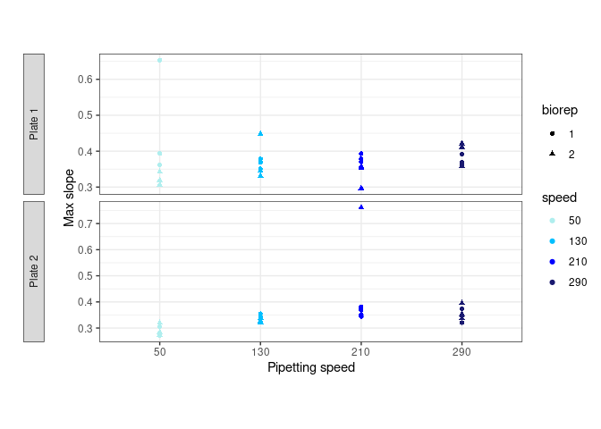
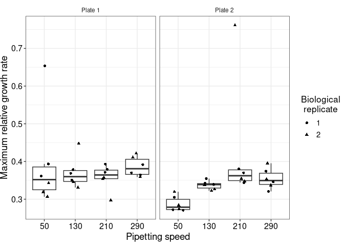

    library(tidyverse)

    ## ── Attaching core tidyverse packages ──────────────────────── tidyverse 2.0.0 ──
    ## ✔ dplyr     1.1.4     ✔ readr     2.1.5
    ## ✔ forcats   1.0.0     ✔ stringr   1.5.1
    ## ✔ ggplot2   3.5.1     ✔ tibble    3.2.1
    ## ✔ lubridate 1.9.3     ✔ tidyr     1.3.1
    ## ✔ purrr     1.0.2     
    ## ── Conflicts ────────────────────────────────────────── tidyverse_conflicts() ──
    ## ✖ dplyr::filter() masks stats::filter()
    ## ✖ dplyr::lag()    masks stats::lag()
    ## ℹ Use the conflicted package (<http://conflicted.r-lib.org/>) to force all conflicts to become errors

# 2つのプレートのqfa結果を統合

    plate1 <- read_csv("../baQFA_plate1/colony_analysis/with_qfa.csv") %>%
      mutate(plate_id = "Plate 1")

    ## Rows: 24 Columns: 18
    ## ── Column specification ────────────────────────────────────────────────────────
    ## Delimiter: ","
    ## chr  (1): name
    ## dbl (17): row, col, maxslp, maxslp_t, nr, nr_t, g, b, source, RNAseq, 96well...
    ## 
    ## ℹ Use `spec()` to retrieve the full column specification for this data.
    ## ℹ Specify the column types or set `show_col_types = FALSE` to quiet this message.

    plate2 <- read_csv("../baQFA_plate2/colony_analysis/with_qfa.csv") %>%
      mutate(plate_id = "Plate 2")

    ## Rows: 24 Columns: 18
    ## ── Column specification ────────────────────────────────────────────────────────
    ## Delimiter: ","
    ## chr  (1): name
    ## dbl (17): row, col, maxslp, maxslp_t, nr, nr_t, g, b, source, RNAseq, 96well...
    ## 
    ## ℹ Use `spec()` to retrieve the full column specification for this data.
    ## ℹ Specify the column types or set `show_col_types = FALSE` to quiet this message.

    integrated_qfa <- bind_rows(plate1, plate2) %>%
      mutate(plate_id = as.factor(plate_id)) %>%
      mutate(speed=as.factor(speed)) %>%
      mutate(biorep=as.factor(biorep))
    write_csv(integrated_qfa, file = "integrated_qfa.csv")

# Relationship with yeast volume

## Load data

    yeast_vol <- read_csv("nanodrop_results.csv") %>%
      mutate(speed = substr(Speed, 2,2) %>% as.numeric()) %>%
      mutate(speed = case_when(
        speed == 4 ~ 290,
        speed == 3 ~ 210,
        speed == 2 ~ 130,
        speed == 1 ~ 50
      ))  %>%
      mutate(biorep = substr(BiologicalReplicates, 2,2) %>% as.numeric()) %>%
      mutate(techrep = substr(TechnicalReplicate, 2,2) %>% as.numeric()) %>%
      select(speed, biorep, techrep, Nanodrop)

    ## Rows: 24 Columns: 6
    ## ── Column specification ────────────────────────────────────────────────────────
    ## Delimiter: ","
    ## chr (5): ID1, BiologicalReplicates, Speed, TechnicalReplicate, 1-column_desc...
    ## dbl (1): Nanodrop
    ## 
    ## ℹ Use `spec()` to retrieve the full column specification for this data.
    ## ℹ Specify the column types or set `show_col_types = FALSE` to quiet this message.

## integrate with qfa data

# speedとnrの関係

log変換をしてから平滑化→差分をとっている。

    integrated_qfa %>%
      ggplot(aes(x=speed, y=nr, shape=biorep, color=speed)) +
      geom_point() +
      scale_color_manual(
          values = c(
            "#afeeee",
            "#00bfff",
            "#0000ff",
            "#191970"
          )
        ) +
      xlab("Pipetting speed") +
      ylab("Max slope") +
      facet_grid(plate_id ~ ., scale="free_y", switch="y") +
      theme_bw() +
      theme(
        aspect.ratio = (1/3),
        strip.placement = "outside",
            strip.switch.pad.grid = unit(1, "cm"),
            axis.title.y = element_text(vjust = -15)
        )

    plot_integrated_log_scaled <- integrated_qfa %>%
      ggplot(aes(x=speed, y=nr)) +
      geom_boxplot(outliers = FALSE) +
      geom_jitter(aes(shape=biorep), width = 0.2) +
      xlab("Pipetting speed") +
      ylab("Maximum relative growth rate") +
      labs(shape="Biological\n replicate") +
      facet_grid(. ~ plate_id, scale="free_y", switch="y") +
      theme_bw() +
      theme(
        #text = element_text(size=10),
        plot.margin= unit(c(2,0, 2, 0), "mm"),
        #aspect.ratio = (1/3),
        strip.placement = "outside",
        strip.switch.pad.grid = unit(1, "cm"),
        axis.title.y = element_text(size = 14, vjust = 1),
         plot.background = element_blank(),
        legend.background = element_blank(),
        strip.background = element_blank(),
         axis.title.x = element_text(size = 14),       # X軸タイトルのフォントサイズ
        axis.text.x = element_text(size = 12, color="black"),        # X軸ラベルのフォントサイズ
        axis.text.y = element_text(size = 12, color="black"),        # Y軸ラベルのフォントサイズ
        legend.title = element_text(size = 13),       # 凡例タイトルのフォントサイズ
        legend.text = element_text(size = 11),        # 凡例ラベルのフォントサイズ
        plot.title = element_text(size = 16, hjust = 0.5)  # プロットタイトルのフォントサイズと中央寄せ
      )
    print(plot_integrated_log_scaled)

    ggsave(plot = plot_integrated_log_scaled, width = 576/72, height = 206/72, filename = "plot_integrated_log_scaled.svg")

## nrを使用・plate間normalizationのみにする（差分でnormalize & elapsed\_time入れる）

    integrated_qfa %>%
      select(biorep, speed, agarPlate, nr) %>%
      rename(spotting_time=agarPlate)

    ## # A tibble: 48 × 4
    ##    biorep speed spotting_time    nr
    ##    <fct>  <fct>         <dbl> <dbl>
    ##  1 1      290           1087. 0.370
    ##  2 2      290           1809. 0.421
    ##  3 1      290           2527. 0.364
    ##  4 2      290           3253. 0.411
    ##  5 1      290           3976. 0.392
    ##  6 2      290           4707. 0.359
    ##  7 1      210           1235. 0.371
    ##  8 2      210           1957. 0.357
    ##  9 1      210           2676. 0.379
    ## 10 2      210           3402. 0.297
    ## # ℹ 38 more rows

    row_medians_nr <- integrated_qfa %>%
      select(row, col, plate_id, nr) %>%
      group_by(row, plate_id) %>%
      summarise(med = median(nr)) %>%
      ungroup()

    ## `summarise()` has grouped output by 'row'. You can override using the `.groups`
    ## argument.

    plate_medians_nr <- integrated_qfa %>%
      select(row, col, plate_id, nr) %>%
      group_by(plate_id) %>%
      summarise(med = median(nr)) %>%
      ungroup() %>%
      arrange(plate_id)
    plate_median_scales_nr <- plate_medians_nr %>% mutate(plate_med_scale_nr = med - med[1]) %>% select(-med)

    integrated_qfa_scaled <- integrated_qfa %>%
      full_join(plate_median_scales_nr) %>%
      mutate(normalized_max_slope_nr=nr - plate_med_scale_nr)

    ## Joining with `by = join_by(plate_id)`

    anova(lm(normalized_max_slope_nr ~ biorep * speed * elapsed_time, data=integrated_qfa_scaled %>%

    rename("spottingTime"=agarPlate)))

    ## Analysis of Variance Table
    ## 
    ## Response: normalized_max_slope_nr
    ##                           Df   Sum Sq   Mean Sq F value Pr(>F)
    ## biorep                     1 0.000174 0.0001743  0.0281 0.8678
    ## speed                      3 0.017285 0.0057616  0.9305 0.4373
    ## elapsed_time               1 0.000900 0.0009001  0.1454 0.7055
    ## biorep:speed               3 0.018572 0.0061906  0.9997 0.4056
    ## biorep:elapsed_time        1 0.010297 0.0102975  1.6630 0.2064
    ## speed:elapsed_time         3 0.040635 0.0135449  2.1874 0.1087
    ## biorep:speed:elapsed_time  3 0.022339 0.0074462  1.2025 0.3246
    ## Residuals                 32 0.198153 0.0061923
